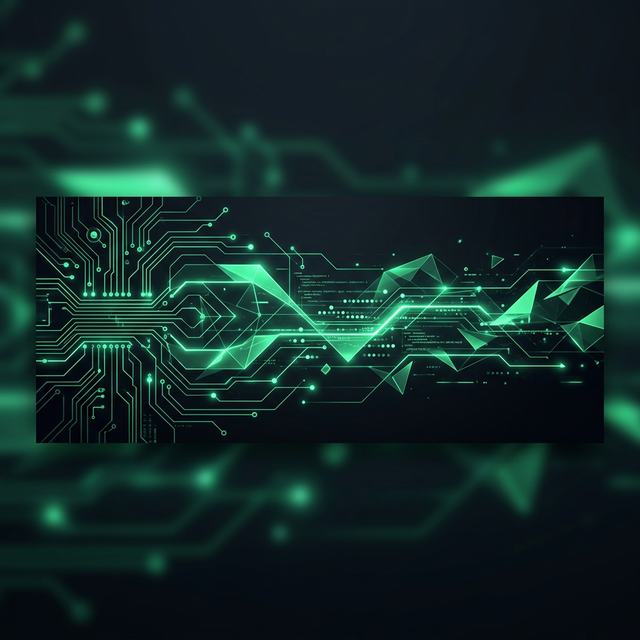

  

<!-- DYNAMIC HUD TYPING EFFECT -->

  

  
  
  

<h3>█▓▒░ SYSTEM_OVERVIEW</h3>

  <b>ARQUIVADO EM:</b> /home/diorgenes/profile/bio.sys  
  <b>OBJETIVO:</b> Projetar ecossistemas digitais de alto impacto na <b>Fundação Beta</b>, transformando fluxos de dados complexos em interfaces de governo intuitivas e eficientes.

<h3>📡 LIVE_STREAM_TELEMETRY</h3>

  
  

  

<h3>🛠️ TECH_CORE_MODULES</h3>
<table border="0">
  <tr>
    <td width="50%" valign="top">
      <h4>[// ENGINE_BACKEND]</h4>
      <code>> Python (FastAPI)</code> 
      <code>> Pandas / NumPy / Polars</code> 
      <code>> Web Scraping / ETL</code> 
      <code>> SQLAlchemy / SQL</code>
    </td>
    <td width="50%" valign="top">
      <h4>[// INTERFACE_WEB]</h4>
      <code>> Next.js / React.js</code> 
      <code>> TypeScript / GSAP</code> 
      <code>> Tailwind CSS / Framer</code> 
      <code>> UI/UX Architecture</code>
    </td>
  </tr>
  <tr>
    <td width="100%" colspan="2">
      <h4>[// INFRA_NETWORK]</h4>
      

        <code>DOCKER</code> | <code>POSTGRESQL</code> | <code>GIT_ACTIONS</code> | <code>CLOUDFLARE</code>
      

    </td>
  </tr>
</table>

<h3>🛰️ UPLINK_CHANNELS</h3>

  
  
  

  

